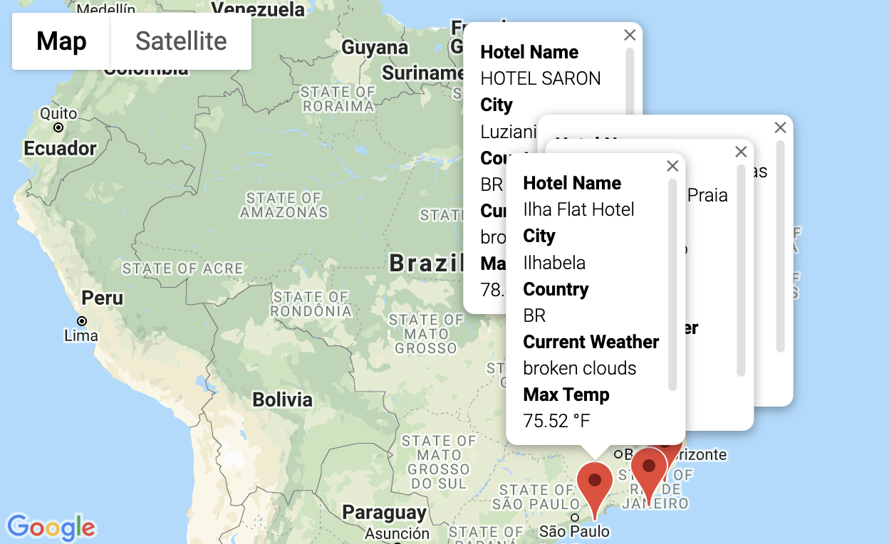
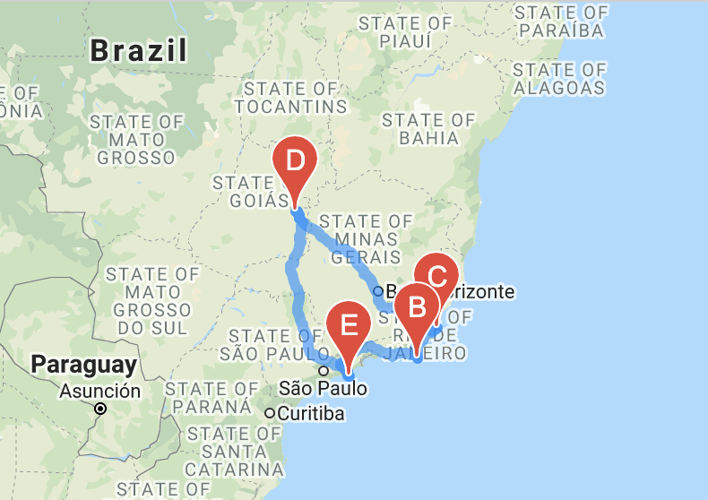

# World Weather Analysis

## Overview

### Initial approach

We were approached by the analytics team of the**PlanMyTrip** app, a top travel technology company that specializes in internet-related services in the hotel and lodging industry. 

Specifically, the head of analysis for user interface team asked us to help with the structural analytics of their search-based operation.

The goal of the user interface operation is:

- To collect and present data for costumers via a search.
- The user will then filter the search based on their preferred travel criteria in order to find their ideal hotel anywhere in the world.

### Basic Project Plan

Here's an outline of our initial project plan:

- **Task:** Collect and analyze weather data across cities worldwide.
- **Purpose:** PlanMyTrip will use the data to recommend ideal hotels based on clients' weather preferences.
- **Method:** Create a Pandas DataFrame with 500 or more of the world's unique cities and their weather data in real time. This process will entail collecting, analyzing, and visualizing the data.

## Programmatic Execution

#### **Collecting the Data**

We started by using **Python** in **Jupyter Notebook**, where we used the **NumPy** **module** to generate more than 1,500 random latitudes and longitudes and then and the **CityPy module** to get the corresponding nearest cities for the random latitudes and longitudes. 

We then performed requests on the **OpenWeatherMap API** and retrieved JSON weather data from each unique city in your list.

The weather data was then transformed from its raw JSON state by parsing the data from the API request.

We formatted columns in a **Pandas** DataFrame on Jupyter Notebook. Our **DataFrame** contained the following data:

- City, country, and date
- Latitude and longitude
- Maximum temperature
- Humidity
- Cloudiness
- Wind speed

#### Exploratory Analysis

We used **Matplotlib** to create a series of scatterplots of the weather parameters for the cities around the world, using the following comparisons:

- Latitude versus temperature
- Latitude versus humidity
- Latitude versus cloudiness
- Latitude versus wind speed

We determined the correlations for the following weather data:

- Latitude and temperature
- Latitude and humidity
- Latitude and cloudiness
- Latitude and wind speed

As part of the analysis, we performed statistical calculations on the data using linear regression on the weather parameters in the Northern and Southern Hemisphere.

#### **Visualization of Travel Data**

We exported the data, cleaned it, and used the weather data to choose the best cities for a vacation based on certain weather criteria, and then mapped those cities using **Jupyter Maps** and **Google Maps and places API**.

We created a series of **heatmaps** using the Google Maps and Places API that showcased the following:

- Latitude and temperature
- Latitude and humidity
- Latitude and cloudiness
- Latitude and wind speed

Moving forward in refining our visualizations, we created heatmaps with pop-up markers that displayed information on specific cities based on a customer's travel preferences. 

Beta testers later recommended adding detailed weather description to the pop-ups of the cities identified as potential travel destinations; and the nearby hotels. 

From the list of potential travel destinations and their detailed weather and touristic descriptions, the beta testers were able to choose cities to create a travel itinerary. Using the **Google Maps Directions API**, we were able to create a travel route between the selected as well as a marker layer map.

## Results & Conclusion

The analytical data, combined with proper ETL pipelines, utilization of interactive heat maps, clean visualizations and accessible itineraries provided the team with the ability to predict the best time of year for travelers to plan their next vacation spot,  combined with tools to enhance the user interface experience.

World map with key touristic cities, best lodging options, and weather information:

Selected cities for sample itinerary:

Traced sample itinerary:

